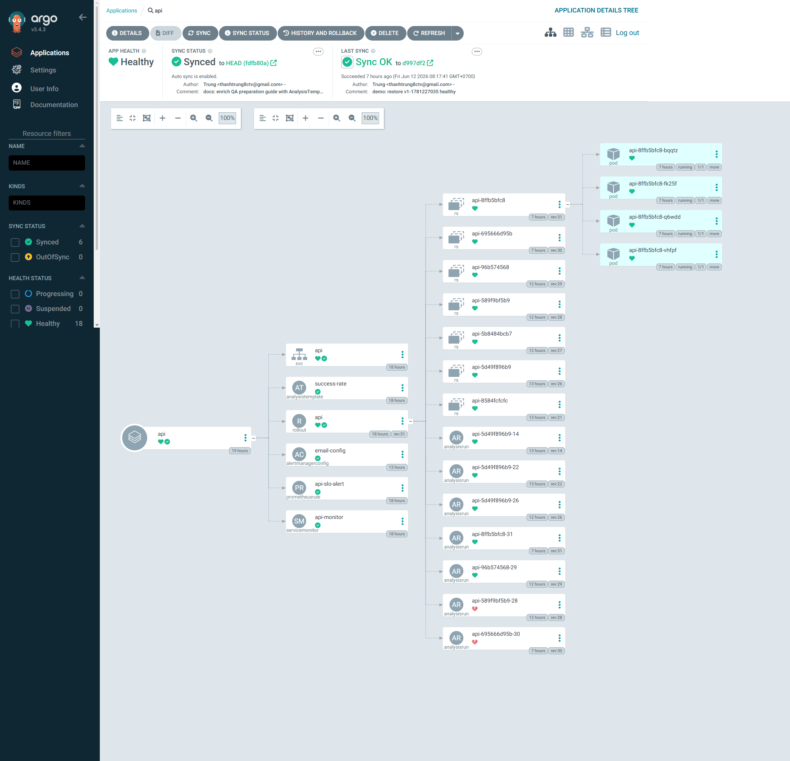
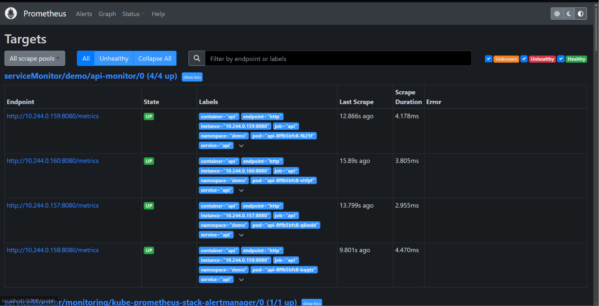

# W9 Final Assignment: Automated Canary Release with GitOps & Observability

## Cấu trúc thư mục (Refactored)

Sau khi dọn dẹp các thư mục `day-a`, `day-b`, `day-c` lộn xộn, code hiện tại được refactor lại cực kỳ gọn gàng theo đúng chuẩn GitOps:

- `app/`: Chứa mã nguồn Flask API và Dockerfile dùng để build image (`w9-api:1`).
- `k8s-api/`: Chứa toàn bộ Kubernetes Manifests cho ứng dụng `api`.
  - `api.yaml`: Định nghĩa **Argo Rollout** (thay cho Deployment) với chiến lược Canary và **Service**.
  - `analysis-template.yaml`: Phân tích số liệu từ Prometheus để tự động quyết định promote (bản tốt -> 100%) hoặc abort (bản lỗi -> rollback) Canary.
  - `servicemonitor.yaml`: Cấu hình Prometheus cào (scrape) metrics `/metrics` từ API.
  - `slo-alert.yaml`: Cấu hình Alerting Rule cho SLO (thông báo khi Error Rate > 5%).
- `argocd/`: Chứa cấu trúc **App of Apps** cho ArgoCD.
  - `root.yaml`: Application gốc quản lý các apps bên trong.
  - `apps/api.yaml`: Quản lý ứng dụng api (trỏ về thư mục `k8s-api`).
  - `apps/argo-rollouts.yaml` & `apps/kube-prometheus-stack.yaml`: Cài đặt Argo Rollouts và Prometheus stack qua Helm.

## Giải thích Query & Ngưỡng (Threshold) cho Canary Analysis

Trong file `k8s-api/analysis-template.yaml`:

```yaml
  metrics:
  - name: success-rate
     interval: 10s
     count: 10
     successCondition: result[0] >= 0.90
     failureLimit: 1
     provider:
       prometheus:
         address: http://kube-prometheus-stack-prometheus.monitoring.svc.cluster.local:9090
         query: |
           sum(rate(flask_http_request_total{status!~"5.*", namespace="demo"}[30s])) 
           / 
           sum(rate(flask_http_request_total{namespace="demo"}[30s]))
```

**Giải thích Query:**
- `sum(rate(flask_http_request_total{status!~"5.*", namespace="demo"}[30s]))`: Tính tổng tốc độ request THÀNH CÔNG trong 30 giây qua.
- `sum(rate(flask_http_request_total{namespace="demo"}[30s]))`: Tính tổng tốc độ CỦA TẤT CẢ request trong 30 giây qua.
- Phép chia này trả về **tỉ lệ thành công (Success Rate)** của API dưới dạng số thập phân từ 0 đến 1.

**Giải thích Ngưỡng (Threshold):**
- `successCondition: result[0] >= 0.90`: Yêu cầu tỉ lệ thành công tối thiểu phải đạt 90%. Nếu thấp hơn ngưỡng này, phân tích sẽ bị coi là failed.
- `count: 10` & `interval: 10s`: Đánh giá sẽ được lặp lại 10 lần, mỗi lần cách nhau 10 giây (tổng thời gian đo lường tối đa 90 giây).
- `failureLimit: 1`: Chỉ cần 1 lần thất bại (Success Rate < 90%), toàn bộ quá trình Rollout sẽ lập tức tự động Abort và đưa API trở về phiên bản cũ an toàn.

## SLO, Alerting & Email Notification (AlertmanagerConfig)

Chúng ta định nghĩa SLO chất lượng dịch vụ và cấu hình cảnh báo tự động thông qua hai thành phần:

### 1. Cấu hình Alerting Rule (`slo-alert.yaml`)
Một alert tên là `HighErrorRateAPI` được thiết lập để liên tục giám sát tỉ lệ lỗi của API:

```yaml
      expr: |
        sum(rate(flask_http_request_total{status=~"5.*", namespace="demo"}[1m])) by (namespace)
        / 
        sum(rate(flask_http_request_total{namespace="demo"}[1m])) by (namespace) > 0.05
      for: 1m
      labels:
        severity: critical
```

* **Giải thích PromQL Query:**
  * Tử số `sum(rate(...status=~"5.*"...[1m])) by (namespace)`: Tính tổng tốc độ các request bị lỗi hệ thống (HTTP status 5xx như 500, 503) trong mỗi namespace trong vòng 1 phút.
  * Mẫu số `sum(rate(...[1m])) by (namespace)`: Tổng lưu lượng request đi vào ứng dụng trong mỗi namespace trong vòng 1 phút.
  * Phép chia trả về **Tỉ lệ lỗi (Error Rate)**. Ở đây, ta gom nhóm theo nhãn `by (namespace)` để đảm bảo giữ lại nhãn `namespace: demo` trong alert (giúp Alertmanager định tuyến chính xác).
* **Ngưỡng Cảnh Báo (Threshold):**
  * Ngưỡng quy định là **`> 0.05`** (tương đương tỉ lệ lỗi vượt quá **5%**).
  * `for: 1m`: Điều kiện vi phạm phải kéo dài liên tục trong ít nhất 1 phút thì alert mới chuyển từ trạng thái `Pending` sang `Firing` (kích hoạt cảnh báo thực sự).
  * `severity: critical`: Nhãn đánh dấu mức độ nghiêm trọng để phân loại luồng định tuyến gửi mail.

### 2. Định tuyến cảnh báo và gửi Email (`alertmanager-config.yaml`)
Cấu hình định tuyến và gửi email cảnh báo về hòm thư cá nhân sử dụng Custom Resource Definition `AlertmanagerConfig` được triển khai trực tiếp tại namespace `demo`:

* **Định tuyến (Routing):**
  * Nhận các cảnh báo có nhãn `namespace: demo` và mức độ `severity: critical`.
  * Gom nhóm các alert theo tên `groupBy: ['alertname']`.
  * `groupWait: 30s`: Chờ 30 giây để gom các alert phát sinh đồng thời trước khi gửi email đầu tiên.
  * `groupInterval: 5m` & `repeatInterval: 12h`: Tần suất gửi thông báo nhắc lại nếu lỗi chưa được khắc phục.
* **Cấu hình SMTP gửi Email:**
  * **Receiver:** `email-receiver` thực hiện gửi email tới `thanhtrung8ctv@gmail.com`.
  * **Smarthost:** Sử dụng máy chủ Gmail SMTP `smtp.gmail.com:587` có mã hóa TLS.
  * **Xác thực:** Tài khoản `thanhtrung8ctv@gmail.com` xác thực an toàn thông qua Kubernetes Secret `email-smtp-secret` (chứa App Password 16 ký tự của Google Gmail).

---

## Các bước chạy thử và Kiểm thử (Verification steps)

### Bước 1: Khởi động Mock Traffic & Dashboard
1. Khởi chạy Dashboard:
   ```bash
   python cloud/w9/dashboard/server.py
   ```
2. Mở trình duyệt truy cập: `http://localhost:9999` để giám sát trạng thái trực quan.

### Bước 2: Kích hoạt Lỗi Canary (Inject Error v2)
1. Trên giao diện Dashboard, bấm nút **`💣 1. Inject Error (v2)`**.
2. Dashboard sẽ tự động cập nhật cấu hình trong `api.yaml`: thiết lập biến môi trường `VERSION=v2-xxxx` và `ERROR_RATE=1.0` (giả lập lỗi sập 100%), sau đó tự động commit và push lên GitHub.
3. ArgoCD ngay lập tức phát hiện thay đổi và đồng bộ (Sync). Argo Rollouts bắt đầu giai đoạn Canary đầu tiên: chuyển giao 25% traffic cho 1 Pod v2 mới tạo, giữ lại 75% traffic ở 3 Pods v1 cũ.

### Bước 3: Quan sát Tự động Abort & Rollback
1. Bộ tạo Traffic giả lập liên tục gửi request vào hệ thống.
2. Vì Pod v2 lỗi 100%, tỉ lệ thành công của hệ thống tụt xuống còn khoảng `75%`.
3. `AnalysisRun` chạy ngầm phát hiện tỉ lệ thành công `< 90%` (yêu cầu của template).
4. Chỉ sau 1 lần kiểm tra thất bại, Argo Rollouts lập tức **hủy bỏ đợt triển khai (Abort)**, xóa bỏ Pod v2 lỗi và khôi phục 100% lưu lượng về 4 Pods v1 an toàn. Trạng thái Rollout trên ArgoCD chuyển sang **Degraded** (cảnh báo hệ thống Canary bị lỗi).

### Bước 4: Kiểm tra Cảnh báo Email
1. Sau khi lỗi kéo dài đủ 1 phút, Prometheus Rule kích hoạt trạng thái alert `HighErrorRateAPI` sang `Firing`.
2. Alertmanager bắt được cảnh báo từ namespace `demo`, định tuyến qua SMTP và gửi email cảnh báo về địa chỉ `thanhtrung8ctv@gmail.com`.
3. Kiểm tra mục **Thư rác (Spam)** hoặc **Quảng cáo (Promotions)** trong hộp thư cá nhân để xem email cảnh báo được gửi tự động từ cụm Kubernetes.

### Bước 5: Phục hồi Hệ thống (Fix & Restore)
1. Trên Dashboard, bấm nút **`🛠️ 2. Fix & Restore`**.
2. Hệ thống sẽ thay đổi cấu hình về trạng thái an toàn ban đầu (`VERSION=v1` và `ERROR_RATE=0.0`), đẩy lên GitHub.
3. ArgoCD tự động đồng bộ lại và đưa cụm K8s trở lại trạng thái **Healthy** hoàn toàn.

---

## Minh chứng triển khai (Deployment Evidence)

### 1. Giao diện ArgoCD ở trạng thái bình thường (Healthy)


### 2. Giao diện Prometheus Targets hoạt động tốt (Up)

